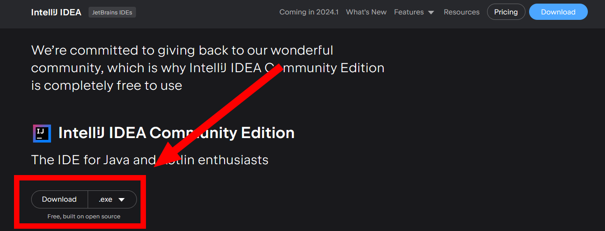
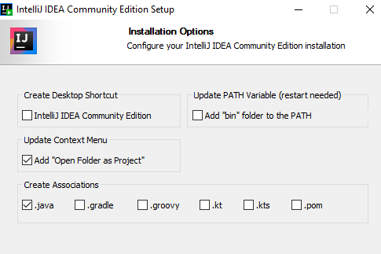

In this section, you will learn how to generate your codebase from the game files and setup the necessary tools to make brand new scripts.

## Setting up IntelliJ Idea

We will use IntelliJ Idea to view and write our clb scripts:

* Go to [IntelliJ's download page](https://www.jetbrains.com/idea/download/?section=windows) and make sure to download the **free Community Edition** which has more than enough features for our needs.

<figure markdown>
  
</figure>

* During the installation process, make sure to tick the **Add "Open Folder as Project"** option, it will make things easier later. Feel free to tick others if you want to, the .java one in particular.

<figure markdown>
  
</figure>

## Generating your codebase

!!! note

    This section assumes that you have already dumped your game files.

Most of the clb scripts rely on a particular set of packages (which define general math functions, UI utilities etc). We are now going to dump these to usable .java files:

* Download the [JavaToCLB archive](https://cdn.discordapp.com/attachments/764599308704022568/1197892700205240352/JavaToCLB.zip) and unzip it.

* Go to the common script game folder by following the path given below:

=== ":fontawesome-solid-gamepad: `Final Fantasy XIII`"

    ``` 
    FINAL FANTASY XIII\white_data\sys\script
    ```

=== ":fontawesome-solid-gamepad: `Final Fantasy XIII-2`"

    ``` 
    FINAL FANTASY XIII-2\alba_data\sys\script
    ```

=== ":fontawesome-solid-gamepad: `Lightning Returns`"

    ``` 
    LIGHTNING RETURNS FINAL FANTASY XIII\weiss_data\sys\script
    ```

* Unpack the following .bin containers located in these folders using Nova's "Unpack WPD File" utility (found in its Mod Tools tab)

``` 
WhiteBaseClassJar.bin
blt\btlclb.bin
```

* Finally, drag and drop the whole **"script"** folder on the **JavatoCLB.exe** executable and it will automatically convert all the clb files to clean .java files, organized in a proper folder structure, in a **"script_decomp"** folder. Wait for the conversion to be done, you can move this folder elsewhere and rename it to something more meaningful like **"FFXIIICodebase"** for example.

* Open this folder as an IntelliJ project by right-clicking it then choosing **"Open folder as project"**. Expand all the files by clicking on the "Expand all" icon at the top:

<figure markdown>
  
</figure>

* Select all your project files by using CTRL-A then go to File -> File Properties -> Remove BOM.

!!! warning

    * Make sure to delete the String.java file, it is useless and will lead to errors during the editing process.

That's it, the codebase is now ready to be used for reading and writing clb scripts.

You can now proceed to the [next page](./repacking.md) to setup the repacking utilities.
