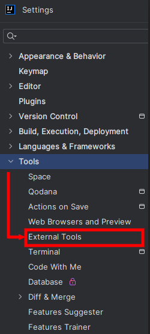
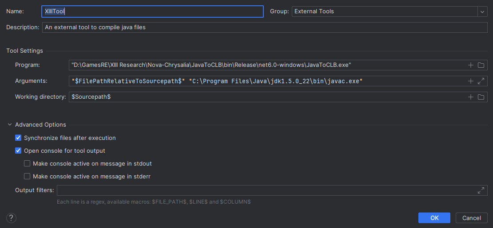

In this section, you will learn how to write your own clb scripts. 

!!! note

    This section assumes that you have already [setup the codebase properly](./extracting.md).

## Installing the Java 5 SDK

We need to use the same Java version as the XIII Trilogy, go to the [Oracle website and download the Java 5 SDK](https://www.oracle.com/java/technologies/java-archive-javase5-downloads.html) and install it.


!!! tip

    To avoid creating an account, right click on the download link and remove everything before "nexturl=" (including it). For example, 
    ```
    https://www.oracle.com/webapps/redirect/signon?nexturl=https://download.oracle.com/otn/java/jdk/1.5.0_22/jdk-1_5_0_22-windows-i586-p.exe
    ```
    becomes 
    ```
    https://download.oracle.com/otn/java/jdk/1.5.0_22/jdk-1_5_0_22-windows-i586-p.exe
    ```

## Setting up the IntelliJ IDEA external tool

We are now going to setup an external tool to compile our .java files to .clb in IntelliJ:

* Open IntelliJ, then go to File->Settings->Tools->ExternalTools:

<figure markdown>
  
</figure>

* Click on the "+" button to create a new one and name it however you want. The following window will appear:

<figure markdown>
  
</figure>

The most important fields are the following:

!!! note
    - Program: put your **JavatoCLB.exe** location here, between quotes ("")
    - Arguments: put 
    ```
    "$FilePathRelativeToSourcepath$"
    ```
    followed by  your **javac.exe** location, from your Java 5 install folder, between quotes ("")
    - Working Directory: put 
    ```
    $Sourcepath$
    ```

That's it, you will now be able to generate your clb file with a single from your .java file by right-clicking the choosing **External Tools -> YourToolName**.


