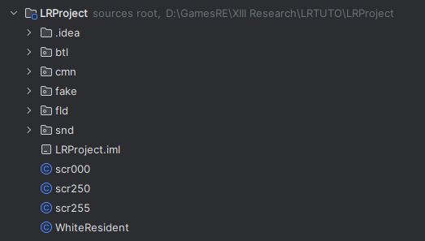

In this example, we are going to repurpose the Ark's teleporter to execute our own custom function.

## Dumping the zone scripts

We first need to dump the zone scripts of the Ark, which are located in 

```

LIGHTNING RETURNS FINAL FANTASY XIII\weiss_data\zone\z0110

```

Drag and drop this folder on the JavaToCLB.exe to do so, you'll end up with 3 decompiled java files. Place them at the root of your codebase, you should end up with a project structure like the following:

<figure markdown>
  
</figure>

## Writing our new logic

By default, the function called when activating the teleporter is "efTelepoMachine", found in in the scr250 file. We are going to have it call our own function that we're going to write in scr000.

!!! note

    You could write this function in any of the scrxxx files.

The original function has the following signature:

=== "`scr250.java`"

  ```java
  public static int efTelepoMachine(String string, String string2)
  ```

So we're going to copy it as is and make it return 1 just like the original one:

=== "`scr000.java`"

  ```java
  public static int efTelepoMachine(String string, String string2) {
    return 1;
  }
  ```

We can now write any logic that we want to happen when using the teleporter. In this example, I'm going to display a quick prompt, fade out in white, display another prompt, fade in in white, display a menu.

=== "`scr000.java`"

  ```java
  public static int efTelepoMachine(String string, String string2) {
        //Fade out
        com.sfShowWindowWithKeyWait((String)"Fade out white.");
        Window.startFadeOutWhite(500);

        //Fade in
        com.sfShowWindowWithKeyWait((String)"Fade in white.");
        Window.startFadeInWhite(500);

        //Menu
        String title = "Did you enjoy it?";
        String[] menuItems = new String[]{"Yes", "No"};
        com.sfCallAskChoiceWindow(title, menuItems, 2);
        int v = com.sfWaitAskChoiceWindowSkipAvailable(title);
        switch (v) {
            case 0: {
                com.sfShowWindowWithKeyWait((String) "Cool!");
                break;
            }
            case 1: {
                com.sfShowWindowWithKeyWait((String) "Too bad...");
                break;
            }
        }
        return 1;
    }
  ```

We're done, it's now time to compile our edited file back to clb. To do so, simply right-click on it then click on External Tools -> YourToolName. Wait for a bit and you will get a compiled scr000.clb file.

You can inject it back ingame using **LayeredFS** or by running the game in **unpacked mode**

!!! note

    To have this mod taken into account, you will also need to do a small database edit. A dedicated tutorial will be written later, for now simply use the [following file](https://cdn.discordapp.com/attachments/884793460501147689/1196577833326227526/script00110.wdb) as a modification of the original one located at
    ```
    LIGHTNING RETURNS FINAL FANTASY XIII\weiss_data\db\script\script00110.wdb
    ```

That's it, you can now go to the teleporter and check out the result:

<div align="center">
<video width="800" height="480" controls>
  <source src="https://cdn.discordapp.com/attachments/884793460501147689/1196578545426776205/2024-01-15_23-14-50.mp4" type="video/mp4">
</video>
</div>


