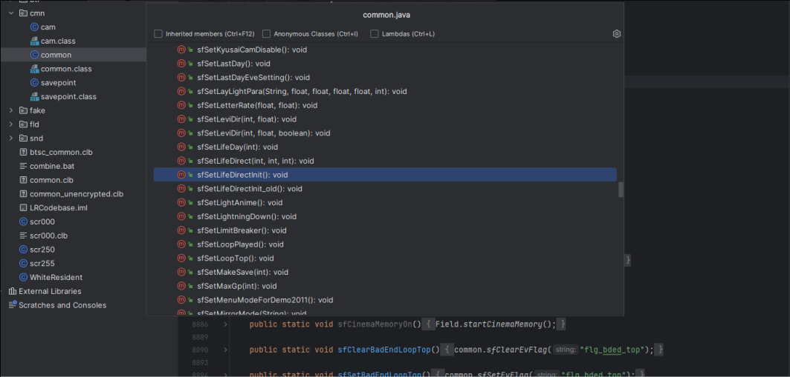
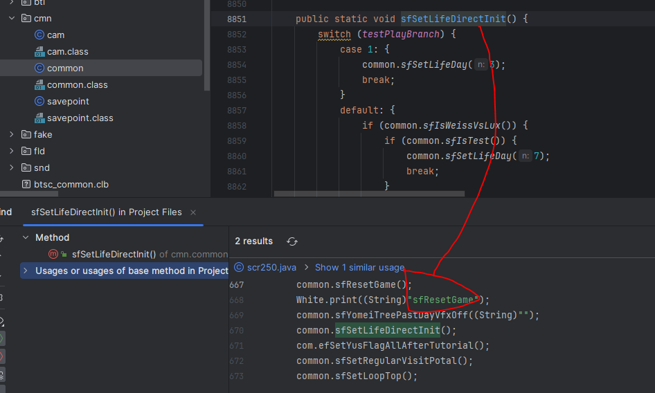
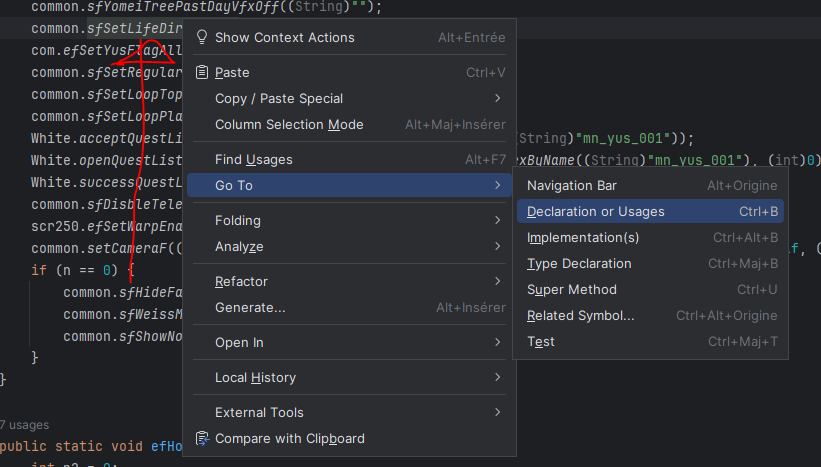

## IntelliJ shortcuts

* CTRL-F12: this will enable you to see all the available methods of the class defined in your current file. 

<figure markdown>
  
</figure>

* Right-click on a function then "Find usages": this will enable you to see in which file(s) the function is called and give you the possibility to jump to it directly. 

<figure markdown>
  
</figure>

* Right-click-> Go to -> declaration or usages: this is the other way around, if you see a function used and want to jump to its definition

<figure markdown>
  
</figure>
